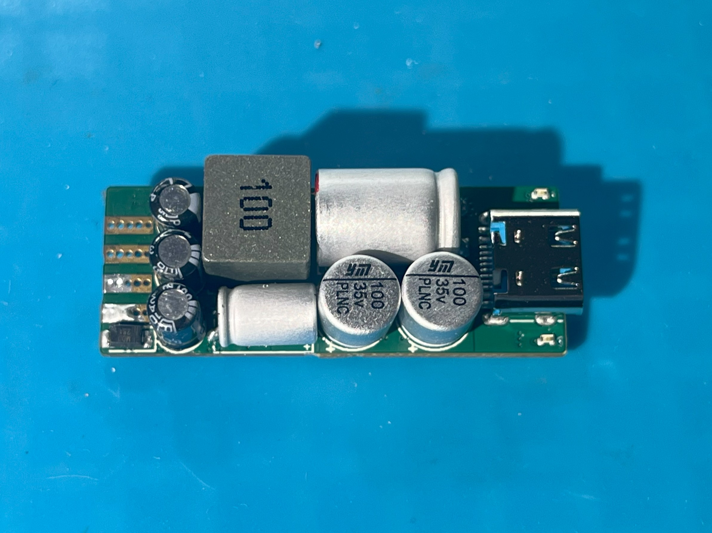
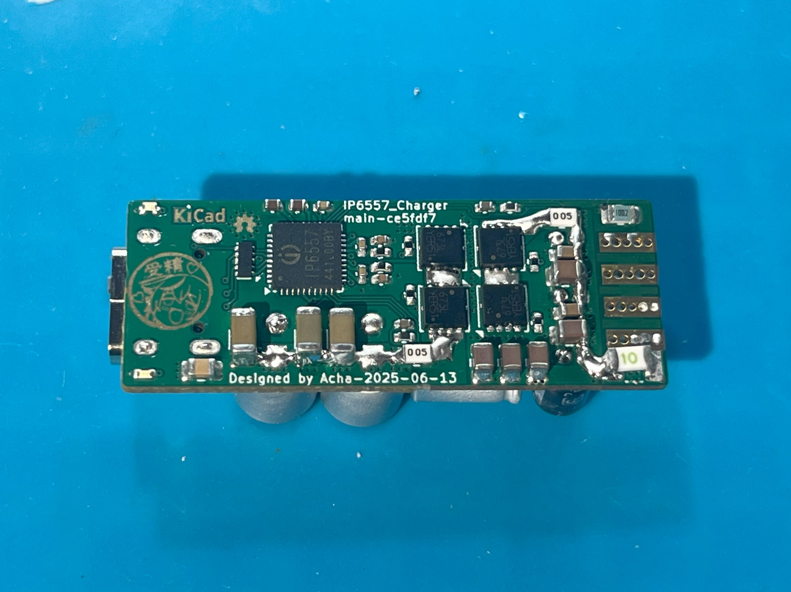

<!--

将如下 readme.md 文件翻译为英文，尽可能保证原有格式不变。添加该文档由ChatGPT翻译的备注。

为中文文档添加到 ./readme-zh.md 的链接: [Chinese Document / 中文文档](./readme-zh.md) | English Document

-->

# IP6557 Charger

[英文文档 / English Document](./readme.md) | 中文文档 / Chinese Document

基于英集芯 IP6557 升降压 SoC 的快充模块

 

## 项目状态

- [x] 原理图设计
- [x] PCB 设计
- [x] PCB 制造
- [x] PCB 验证

## 器件概览

- **[IP6557-C]()**：集成升降压控制器以及 USB-C 接口输出快充协议的 SoC
- **[NTTFS5C673NL](https://www.onsemi.com/download/data-sheet/pdf/nttfs5c673nl-d.pdf) MOSFET**：$`V_{DS}=60\,\text{V},\;R_{DS(\mathrm{on})}=11\,\text{m}\Omega,\;C_{\mathrm{iss}}=880\,\text{pF},\;Q_{g(\mathrm{th})}=1.0\,\text{nC}\;@\,4.5\,\text{V}`$

## 基本电路板参数

| 参数           | 数值              |
|:-------------:|:----------------:|
| **尺寸**       | 38.50mm x 14.70mm |
| **形状**       | 圆角矩形，r=0.50mm |
| **成品板厚**   | 1.00mm            |
| **铜箔层数**   | 4                  |
| **最小线宽**   | 0.12mm             |
| **最小线距**   | 0.12mm             |
| **最小金属化孔径** | 0.20mm          |
| **最小非金属化孔径** | 0.65mm      |
| **最小过孔外径** | 0.45mm            |
| **最小过孔内径** | 0.20mm            |
| **最小金属化槽宽** | 0.60mm         |
| **最小非金属化槽宽** | 无              |

## 项目说明

本项目使用 KiCad 9.0.2 进行设计。

已部署 GitHub Action CI/CD，每次提交都会自动执行 DRC 检查，并生成 Gerber 等制造文件。

制造文件可在 [Release 页面](https://github.com/acha666/IP6557_Charger/releases) 或 [Workflow](https://github.com/acha666/IP6557_Charger/actions/workflows/kicad-ci.yml) 下载。

### 备注
